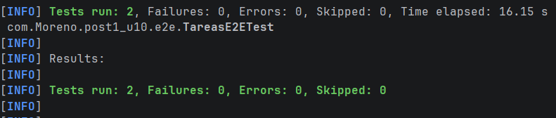
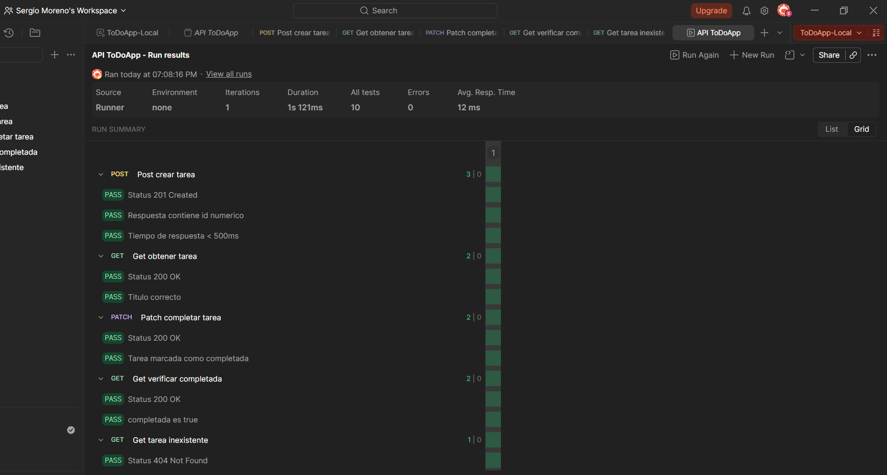

# Post-Contenido 2 — Pruebas E2E con Selenium, Postman y Newman

**Programación Web — Unidad 10: Pruebas de Software en Aplicaciones Web**  
**Ingeniería de Sistemas — UDES 2026**

---

## Descripción

Implementación de pruebas de extremo a extremo (E2E) sobre la aplicación
Spring Boot de gestión de tareas del Post-Contenido 1, aplicando el patrón
Page Object Model con Selenium WebDriver, una colección de pruebas de API
REST en Postman con test scripts, y automatización mediante Newman integrado
en un pipeline de GitHub Actions.

---

## Requisitos previos

- Java 17+
- Maven 3.9.x (o usar el wrapper `mvnw` incluido)
- Google Chrome (versión estable)
- Node.js 18+ con npm
- Newman 6.x (`npm install -g newman`)
- Postman Desktop v10+ (para editar la colección)

---

## Estructura del Proyecto
```plaintext
Moreno-post2-u10/
├── .github/
│   └── workflows/
│       └── api-tests.yml
├── postman/
│   ├── ColeccionToDo.json
│   ├── env-local.json
│   └── env-ci.json
├── src/
│   ├── main/java/com/Moreno/post1_u10/
│   │   ├── controller/
│   │   │   ├── TareaController.java
│   │   │   └── TareaViewController.java
│   │   ├── entity/
│   │   │   └── Tarea.java
│   │   ├── exception/
│   │   │   └── GlobalExceptionHandler.java
│   │   ├── repository/
│   │   │   └── TareaRepository.java
│   │   └── service/
│   │       └── TareaService.java
│   └── test/java/com/Moreno/post1_u10/
│       ├── controller/
│       │   └── TareaControllerTest.java
│       ├── e2e/
│       │   ├── NuevaTareaPage.java
│       │   ├── TareasPage.java
│       │   └── TareasE2ETest.java
│       ├── repository/
│       │   └── TareaRepositoryTest.java
│       └── service/
│           └── TareaServiceTest.java
└── pom.xml
```

---

### Clases implementadas

**TareasPage.java** — encapsula los selectores y acciones de la página principal:
- `contarTareas()` — cuenta los elementos con clase `.tarea-item`
- `obtenerTituloPagina()` — retorna el título del navegador
- `obtenerEncabezado()` — retorna el texto del `<h1>`
- `botonNuevaVisible()` — verifica que el botón Nueva Tarea esté visible

**NuevaTareaPage.java** — encapsula los selectores del formulario de nueva tarea.

**TareasE2ETest.java** — tests en modo headless:
- `paginaTareas_cargaCorrectamente` — verifica que el título contiene "Tareas"
- `paginaTareas_botonNuevaVisible` — verifica que el botón Nueva Tarea es visible

---

### Los 5 requests de la colección

| # | Método | Endpoint | Qué verifica |
|---|--------|----------|-------------|
| 1 | POST | `/api/tareas` | Status 201, respuesta tiene id, guarda tareaId |
| 2 | GET | `/api/tareas/{{tareaId}}` | Status 200, titulo correcto |
| 3 | PATCH | `/api/tareas/{{tareaId}}/completar` | Status 200, completada es true |
| 4 | GET | `/api/tareas/{{tareaId}}` | Status 200, verifica completada true |
| 5 | GET | `/api/tareas/99999` | Status 404 Not Found |

### Evidencia Checkpoint 2


---

## Checkpoint 3 — Newman en GitHub Actions

### Cómo funciona el pipeline

El workflow `.github/workflows/api-tests.yml` se ejecuta automáticamente
en cada `push` o `pull_request` y realiza estos pasos:

1. Checkout del código
2. Configura Java 17
3. Compila el proyecto con Maven
4. Inicia la aplicación en segundo plano
5. Espera que la app responda en el puerto 8080
6. Instala Newman
7. Ejecuta la colección con el entorno CI

### Evidencia Checkpoint 3


---

## Evidencias

| Evidencia | Descripción |
|-----------|-------------|
| `evidencia/selenium-tests-verde.png` | 2 tests de Selenium en verde |
| `evidencia/postman-runner-0-failures.png` | Postman Runner con 0 failures |
| `evidencia/github-actions-verde.png` | GitHub Actions con check verde |

---

## Tecnologías usadas

| Tecnología | Versión | Uso |
|-----------|---------|-----|
| Spring Boot | 3.2.5 | Framework base |
| Selenium Java | 4.18.1 | Pruebas E2E de interfaz web |
| WebDriverManager | 5.8.0 | Gestión automática de ChromeDriver |
| Postman | v10+ | Diseño de colección de pruebas API |
| Newman | 6.2.2 | Ejecución de colección desde terminal |
| GitHub Actions | — | Pipeline de integración continua |

---

## Tecnologías usadas

| Tecnología | Versión | Uso |
|-----------|---------|-----|
| Spring Boot | 3.2.5 | Framework base |
| Selenium Java | 4.18.1 | Pruebas E2E de interfaz web |
| WebDriverManager | 5.8.0 | Gestión automática de ChromeDriver |
| Postman | v10+ | Diseño de colección de pruebas API |
| Newman | 6.2.2 | Ejecución de colección desde terminal |
| GitHub Actions | — | Pipeline de integración continua |

---

## Evidencias

- Selenium test


- Postman run


- Github actions


